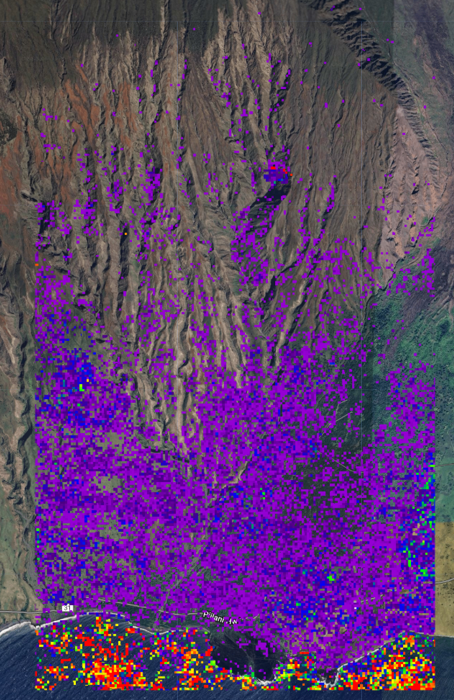
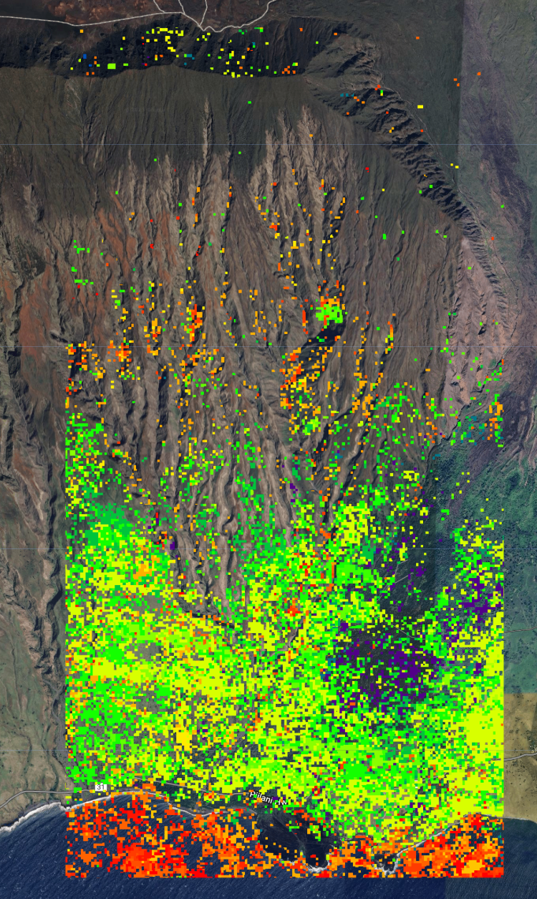
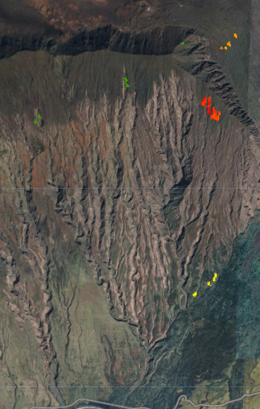

# Haleakal_NPS

Code base for rapid landcover change (Landtrendr) and erosion (RSULE) monitoring for NPS collaboration

-  '200'
<!---
#-  '#4B0082'
#-  '#0000FF'
#-  '#00FF00'
#-  '#FFFF00'
#-  '#FF7F00'
-->
-  '800'

-  '1985'
-  '2024'

